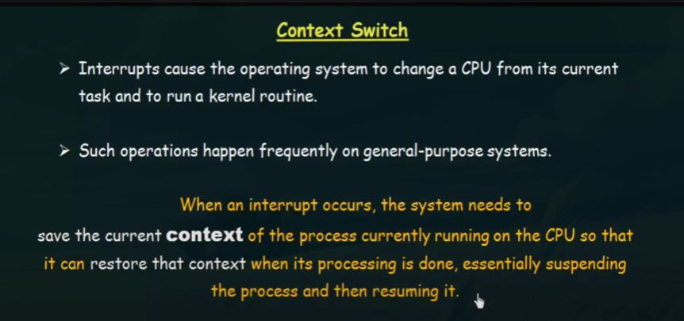

# Operating System Notes for Placements

---

## 1. Basics & Fundamentals (Medium, Theory)

### 📘 Theory

- **Operating System (OS):** Software that manages hardware and software resources, acts as an interface between user and hardware.
- **Functions:** Process management, memory management, file management, I/O management, and security.
- **Types of OS:** Batch, Multiprogramming, Multitasking, Real-time, Distributed.

```
Batch OS → Executes jobs in batches, no user interaction.

Multiprogramming OS → Runs multiple programs in memory, CPU never idle.

Multitasking OS → Allows single user to perform multiple tasks at once.

RTOS → Provides immediate response for critical tasks.

Distributed OS → Multiple computers work together as one system.
```

- **System Calls:** Mechanism for user programs to request services from OS (e.g., `fork()`, `exec()`, `read()`).
- **Kernel vs User Space:** Kernel space = core privileged code; User space = application programs.

### 📖 Theory Questions

1. Define an Operating System. List its main functions.
2. Differentiate between Kernel space and User space.
3. What are system calls? Give two examples.

### ❓ MCQs

1. Which of the following is **not** a function of OS?  
   a) Memory management  
   b) Process scheduling  
   c) Compiling source code  
   d) File management

2. Which type of OS is used in **airline control systems**?  
   a) Batch OS  
   b) Real-time OS  
   c) Distributed OS  
   d) Multiprogramming OS

### Answers

- Theory: Any descriptive correct explanation.
- MCQ 1 → **c)**
- MCQ 2 → **b)**

---

## 2. Process Management (Important, Theory + Some Problems)

### 📘 Theory

- **Process:** A program in execution (active entity).
- **Thread:** Smallest unit of CPU execution, lightweight compared to process.
- **Process States:** New → Ready → Running → Waiting → Terminated.
- **PCB (Process Control Block):** Stores process info (state, program counter, registers, memory).
- **Context Switching:** Saving state of one process and loading another → overhead but necessary.



- [Youtube video](https://youtu.be/vTgccrbYHYs?si=b9EbJVvy_IHOv2y_)

- **CPU-bound vs I/O-bound:** CPU-bound needs more computation; I/O-bound waits more for I/O.

### CPU Scheduling

- A process execution consists of a cycle of CPU execution and I/O execution.
- Normally, every process begins with a CPU burst that may be followed by an I/O burst, then another CPU burst and then I/O burst, and so on. Eventually, in the last, it will end up on a CPU burst.

## CPU Bound Process

There are those processes which require most of the time on CPU.

## I/O Bound Process

There are those processes which require most of the time on I/O devices or peripherals.

## Conclusion

A good CPU scheduling idea should choose the mixture of both so that both I/O devices and CPU can be utilized efficiently.

### 📖 Theory Questions

1. Explain the difference between Process and Thread.
2. What is Context Switching and why is it expensive?
3. Describe the role of PCB.

### ❓ MCQs

1. Which of the following is **stored in PCB**?  
   a) Process state  
   b) Program counter  
   c) CPU registers  
   d) All of the above

2. A thread is also called a:  
   a) Heavyweight process  
   b) Lightweight process  
   c) Independent process  
   d) None of these

### Answers

- MCQ 1 → **d)**
- MCQ 2 → **b)**

---

## 3. CPU Scheduling (Important, Problem-Solving)

### 📘 Theory

- **CPU Scheduling:** CPU Scheduling is the method used by the operating system to decide which process from
  the ready queue should be executed by the CPU next when multiple processes are waiting.

## Why CPU Scheduling is Needed?

- In a multiprogramming system, there are always more processes than CPUs.

- The CPU must be kept as busy as possible.

- If the CPU is idle while processes are waiting, system performance drops.

- CPU scheduling ensures fairness, efficiency, and responsiveness.

### **Criteria:** Waiting time, Turnaround time, Throughput, CPU utilization, Fairness.


- **Algorithms:**
  - FCFS → simple but may cause **convoy effect**.
  - SJF → optimal in theory but requires burst prediction.
  - Priority Scheduling → risk of **starvation**.
  - Round Robin → time quantum ensures fairness.
  - Multilevel Queue → divides processes into queues.

### 📖 Theory Questions

1. Define Turnaround Time and Waiting Time.
2. Why is Round Robin considered **fair** scheduling?
3. Differentiate between Preemptive and Non-preemptive scheduling.

### ❓ MCQs

1. In which scheduling algorithm can **Starvation occur**?  
   a) Round Robin  
   b) FCFS  
   c) Priority Scheduling  
   d) Multilevel Queue

2. If time quantum is too large in Round Robin, it behaves like:  
   a) SJF  
   b) Priority Scheduling  
   c) FCFS  
   d) Multilevel Queue

### Answers

- MCQ 1 → **c)**
- MCQ 2 → **c)**

---

## 4. Synchronization & Deadlocks (Important, Theory + Numerical)

### 📘 Theory

- **Race Condition:** When multiple processes access shared data concurrently → inconsistent results.
- **Critical Section Problem:** Code section accessing shared data must be executed by only one process at a time.
- **Solutions:** Semaphores, Mutex locks, Peterson’s Algorithm.
- **Deadlock Conditions (Coffman’s):** Mutual exclusion, Hold and wait, No preemption, Circular wait.
- **Deadlock Handling:** Prevention, Avoidance (Banker’s Algorithm), Detection, Recovery.

### 📖 Theory Questions

1. What is a Race Condition? Give an example.
2. Explain the four Coffman’s conditions for deadlock.
3. How does Banker’s Algorithm avoid deadlock?

### ❓ MCQs

1. Which is **not** a necessary condition for deadlock?  
   a) Mutual Exclusion  
   b) Hold and Wait  
   c) Circular Wait  
   d) Preemption

2. Semaphore value `S=1` represents:  
   a) Resource free  
   b) Resource busy  
   c) Both (depending on state)  
   d) None

### Answers

- MCQ 1 → **d)**
- MCQ 2 → **a)**

---

## 5. Memory Management (Important, Problem-Solving)

### 📘 Theory

- **Logical vs Physical Address:** CPU generates logical, MMU translates to physical.
- **Paging:** Divides memory into fixed-size blocks (frames, pages).
- **Segmentation:** Divides memory based on program’s logical divisions (functions, arrays).
- **Virtual Memory:** Allows programs to use more memory than physically available.
- **Page Replacement Algorithms:**
  - FIFO (simple, may cause **Belady’s Anomaly**)
  - LRU (based on past usage)
  - Optimal (best but theoretical).
- **Thrashing:** Too much paging, CPU spends more time swapping than executing.

### 📖 Theory Questions

1. Differentiate between Paging and Segmentation.
2. What is Belady’s Anomaly?
3. Define Thrashing and how it affects performance.

### ❓ MCQs

1. Which page replacement algorithm is **least prone** to Belady’s Anomaly?  
   a) FIFO  
   b) LRU  
   c) Optimal  
   d) Both b & c

2. Virtual memory is:  
   a) Larger than physical memory  
   b) Same as physical memory  
   c) Part of cache memory  
   d) Always equal to main memory

### Answers

- MCQ 1 → **d)**
- MCQ 2 → **a)**

---

## 6. File Management (Medium, Theory)

### 📘 Theory

- **File:** Collection of related data.
- **Access Methods:** Sequential, Direct (Random), Indexed.
- **File Allocation Methods:**
  - Contiguous → simple, but external fragmentation.
  - Linked → no external fragmentation, slow access.
  - Indexed → uses index block, supports direct access.
- **Directory Structures:** Single-level, Two-level, Tree-structured, Acyclic Graph.

### 📖 Theory Questions

1. Differentiate between Contiguous and Linked allocation.
2. What is Indexed allocation? Advantages?
3. Explain Tree-structured directory.

### ❓ MCQs

1. Which file access method is used in CD-ROM?  
   a) Sequential  
   b) Direct  
   c) Indexed  
   d) All of the above

2. Which allocation method suffers from **external fragmentation**?  
   a) Linked  
   b) Contiguous  
   c) Indexed  
   d) None

### Answers

- MCQ 1 → **a)**
- MCQ 2 → **b)**

---

## 7. Disk Scheduling (Medium, Problem-Solving)

### 📘 Theory

- **Disk Access Time = Seek time + Rotational Latency + Transfer time**.
- **Scheduling Algorithms:**
  - FCFS → simple, fair.
  - SSTF → chooses nearest request, reduces seek time, but **starvation possible**.
  - SCAN → moves like an elevator, services in one direction then reverses.
  - C-SCAN → moves only in one direction, provides uniform wait time.
  - LOOK / C-LOOK → similar but stops at last request instead of disk end.

### 📖 Theory Questions

1. Why is SSTF better than FCFS?
2. Explain SCAN (Elevator Algorithm).
3. Which algorithm gives the best throughput in general?

### ❓ MCQs

1. Which algorithm can cause **starvation**?  
   a) SSTF  
   b) SCAN  
   c) FCFS  
   d) LOOK

2. C-SCAN is better than SCAN because:  
   a) It reduces variance in response time  
   b) It is simpler to implement  
   c) It avoids starvation completely  
   d) None

### Answers

- MCQ 1 → **a)**
- MCQ 2 → **a)**

---

## 8. Input/Output Management (Low, Theory)

### 📘 Theory

- **Buffering:** Temporary storage for smooth data transfer between devices with speed mismatch.
- **Spooling:** Simultaneous peripheral operations → jobs stored in buffer (e.g., print spooling).
- **Device Drivers:** Software that allows OS to interact with hardware devices.

### 📖 Theory Questions

1. What is the difference between Buffering and Spooling?
2. Why are device drivers needed?

### ❓ MCQs

1. Spooling is commonly used in:  
   a) Disk scheduling  
   b) Printing  
   c) Paging  
   d) Segmentation

2. Buffering improves:  
   a) CPU Utilization  
   b) I/O Performance  
   c) Memory Utilization  
   d) None

### Answers

- MCQ 1 → **b)**
- MCQ 2 → **b)**

---

## 9. Advanced / Optional (Low, Theory + Practical Awareness)

### 📘 Theory

- **Demand Paging:** Load pages only when needed → reduces memory usage.
- **Working Set Model:** Set of pages actively used by a process.
- **IPC (Inter-process Communication):** Mechanisms like pipes, message queues, shared memory.
- **UNIX/Linux Commands:** `ps`, `kill`, `top`, `ls`, `pwd`.

### 📖 Theory Questions

1. Explain Demand Paging with an example.
2. Differentiate between Pipes and Message Queues.
3. What is the Working Set Model?

### ❓ MCQs

1. Which of the following is a **blocking IPC mechanism**?  
   a) Shared Memory  
   b) Pipes  
   c) Message Queue  
   d) Signals

2. In Linux, which command shows running processes?  
   a) `ps`  
   b) `ls`  
   c) `cd`  
   d) `pwd`

### Answers

- MCQ 1 → **b)**
- MCQ 2 → **a)**
